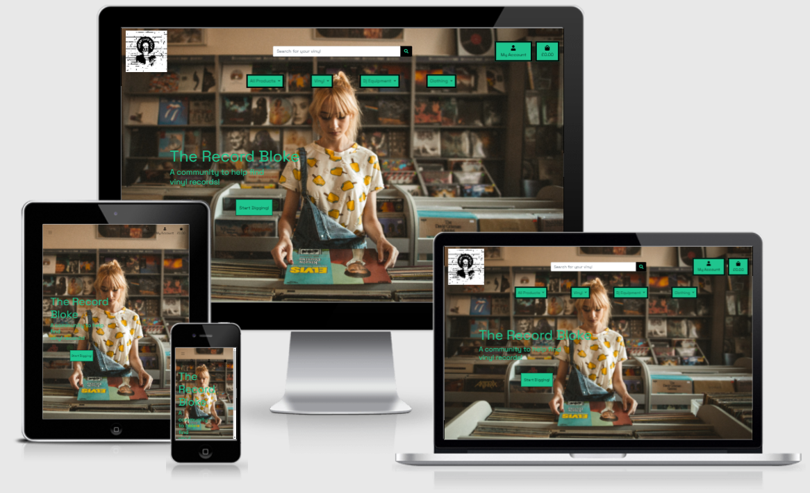

<h1 align="center"><strong>The Record Bloke</strong></h1>

<h2>4th Milestone Project</h2>

[View the live project here]()



# Table Of Contents

1. [Overview](#overview)
2. [UX - Five UX Planes](#ux---five-ux-planes)
    * [Strategy](#strategy)
        * [Target Audience](#target-audience)
        * [Business Goals](#business-goals)
        * [User Stories](#user-stories)
    * [Scope](#scope)
    * [Structure](#structure)
    * [Skeleton](#skeleton)
        * [Wireframes](#wireframes)
    * [Surface](#surface)
        * [Colours](#colours)
        * [Typography](#typography)
        * [Imagery](#imagery)
3. [Features](#features)
    * [Current Features](#current-features)
    * [Future Features](#future-features)
4. [Technologies Used](#technologies-used)
    * [Languages](#languages)
    * [Frameworks](#frameworks)
5. [Testing](#testing)
6. [Deployment](#deployment)
    * [Heroku](#heroku)
    * [AWS](#aws)
7. [Credits](#credits)

# Overview

The Record Bloke is an e-commerce website aimed to sell vinyl records, dj equipment and clothing. The visitors will be given the option to flick through a catalog, arranged by product nature, category, ratings, etc. 

The website has been designed to be responsive, intuitive and accessible on a range of devices, including smartphones, tablets and desktops/laptops.

[Back to Contents](#table-of-contents)

# UX - Five UX Planes

## Strategy

### Target Audience
The target audience of my site is music lovers, specially vinyl collectors. It is geared towards both current and new collectors, and includes products for both of these types of users. 

### Business Goals
-	To provide an easily navigable e-commerce site
-	Connect with users via social media and through blog posts
-	Making a profit by selling products

### User Stories
### Common User Stories
-	To be able to easily navigate through the site on any size screen
-	Search for products
-	Sort products by Price, Name etc.
-	View product details
-	Ability to choose quantity of items, and size if applicable
-	Able to purchase products without an account
-	View their shopping bag and amend their order

### First Time Users
-	Understand the purpose of the site
-	See the reasons behind registering for an account
-	Being able to easily sign up for an account

### Returning Users
-	Ability to securely log into their account
-	View their past orders and order confirmations
-	Purchase products and have their orders saved to their profile
-	Receive their order confirmations directly to their email inbox

### Site Owner/Admin
-	Provide a clean, simple e-commerce store so that users can easily find what they’re looking for
-	Have the ability to add, edit/update and delete products
-	Keep the site secure by only allowing authorised users to access certain areas of the site
-	Securely store user information in case an error occurs

---

## Scope

The following features were implemented to reflect the user stories. For a full list of features please see the [Features](#features) section.
-	Clear and fully responsive site design and navigation
-	Detailed Product pages 
-	Working and secure payment system
-	Secure authorisation 
-	Profile page
-	Full admin access

---

## Structure

The structure of my site is shown below. I outline the apps I have, and what HTML files and Models sit within those apps to make my site work;

### Home App 

**HTML files**

index.html
- This is the main page of my site. There is a carousel with two images.  

### Products App

**HTML files**

add_product.html
- Template that contains a form to add a product. Only the admin has access to this page.

edit_product.html
- Similar template and form as the one to add a product, but allows the admin to edit an existing product.

product_detail.html
- Displays the Product detail page to the user. Shows the Product name, image, description, price, SKU and size (if applicable) and quantity options. The user is also given the option to add this product to their shopping bag in their size and quantity of choice. At the bottom of this page is a review section. 

products.html
- Displays a list of Products that are available to purchase to the user. The Products displayed on this page will differ depending on which Category, Brand or specified search query the user is searching by. If none have been selected, it will display all Products available on the site.

**Models**

Category
- Stores the Product categories.

Product
- Stores individual Product information.

### Bag App

**HTML files**

bag.html
- Users can view their shopping bag contents here, make changes to quantities of products and continue securely to the checkout page.

### Checkout App

**HTML files**

checkout.html
- Displays the final checkout page to the user. They can view their order via a summary, and complete a form with their personal details on so they can have the product/s delivered to them. This is where they will be asked to input their payment information, and once the “Complete Order Securely” button has been clicked, payment will be taken and the order processed. A warning note is placed below this button to warn users of this. 

checkout_success.html
- This is a confirmation page, and one that will be shown to the user upon successful completion of an order. Here will be the order confirmation summary, with all of the details of the order and the personal details the user put in on the page prior. 

**Models**

Order
- Holds information of each order, and is created when a user completes the checkout. 

OrderLineItem
- Contains information of each product added to the bag. 

### Profiles App 

**HTML files**

profile.html
- Displays the users profile to the user. Contains their saved personal details and order history. Only accessible by someone who is registered to the site. 

**Models**

UserProfile
- This model securely stores information on each user. Information is pulled from this Model to pre-fill the personal information form on the checkout page if the user is logged in, and has information saved. 


## Skeleton

### Wireframes [https://drive.google.com/drive/folders/1j372lHI0HSilU4DPGSjHhVvaFiUFVIqo?usp=sharing]


## Surface

### Colours

The following colours were the main colours I used for my site;

White
- This was the background colour used for all of my pages. I didn't want any other colours as it would have detracted from the bright colours I had chosen for the other sections of each page. White was also used for the main logo on desktop view, and as a hover colour for certain buttons across the site.

Black
- I used black as the colour of the text. As I had a white background I chose black to stand out the most. The other colours I chose were being used for emphasis so I didn't want to overuse them. 

### Other Colours

Bootstrap Colour Classes
- Various Bootstrap colour classes were used for alerts, warning, success messages etc.

### Typography

I have used 1 font in this project, which I sourced from Google Fonts;
- Space Grotesk

### Imagery

Using imagery is really important on websites as it allows the user to understand visually what the theme of the site is, and see exactly what is going on. Users also need to see images of the products they are searching for so they can make informed choices on what products suit their needs the most. 

[Back to Contents](#table-of-contents)

# Features

## Current Features

### All/Multiple Page Features

Responsiveness
- The site is fully responsive, regardless of device type and screen size.

Navbar
- The Navbar is the same across all pages. The top navbar has the site logo, a working search bar, an account dropdown and a link to the shopping bag. The bottom navbar has links to all areas of the site. Dropdowns are used for the product pages for easy navigation.

Messages/Toasts
- Messages and Toasts are used when executing certain actions on the site, such as logging in and out, adding and removing products from the shopping bag, completing a transaction, and for admin actions too like adding and editing products. 

Headers
- All headers (H1) elements are the same across the site, using the same font, size and colour. The placing of headers is mixed between central alignment, and left alignment depending on the layout of the page.

Buttons
- Buttons are used throughout the site to choose certain options, confirm choices etc. I mainly use 3 different button colour schemes throughout the site, and have given these specific classes so that the buttons flow correctly through the site. 


### Page Specific Features

Home
-	Carousel images with buttons that send the user to the relevant product pages

Products
-	Products are displayed in a responsive format
-	Featured images at the top of each main category page
-	Product Category buttons so the user can select which sub-category they would like to look at
-	Basic filtering options to sort products by category, name, price etc.
-	Basic product info is displayed to the user such as the product image, name, price, category link, and for admins, edit/delete buttons
-	Users can click on the product images which will take them to the product details page for that particular product

Product Detail
-	Product details shown to user; image, name, price, edit/delete buttons for admins and description
-	Size selector (if applicable)
-	Quantity selector that allows the user to choose the quantity they would like to purchase
-	Keep Shopping button that takes the user back to the products page
-	Add To Bag button that adds the product to the users shopping bag
-	Review section with user reviews that can be viewed by all users regardless of registered status
-	If a user is registered and logged in, they can leave a review for the product

Shopping Bag
-	Shows the user the product/s that they have in their bag
-	Displays product image, name, size, SKU
-	Quantity selector allows user to see how many they have in their shopping bag and amend that amount
-	Subtotal shows the cost of the product, reflects changes upon quantity amendments
-	Bag total, delivery and grand total show these amounts to the user
-	Keep Shopping button allows the user to navigate back to the products page
-	Secure Checkout buttons takes the customer to the Checkout page

Checkout
-	Order summary that shows the product info that the user will be purchasing
-	Delivery form that allows users to input a name, email address and their delivery details
-	Payment input using Stripe
-	Back To Bag button that takes the user back to the shopping bag so they can amend their order
-	Complete Order Securely button that allows the user to process their order. This processes their payment method and completes the order
-	Text warning alerting the user that payment WILL be taken upon completing their order

Checkout Success/Order History
-	Order details provided to the user including products ordered, costs and delivery details
-	Button at the bottom of the screen showing an option to either navigate back to products page or back to the users profile depending on whether the user completed a new order, or viewed a previous order from the profile screen

Sign Up/Sign In
-	Allows the user to sign up for an account using their email address
-	Allows the user to log in using their email or username

Profile
-	Shows the users default delivery information and allows them to update it freely
-	Order History section allows users to see an overview of past orders, and if they click on the order number it takes them to the Order History page 

Add Products – Admin Only 
-	Crispy form is used to generate the form for adding a product
-	Allows the admin to enter necessary details of the product
-	Option to add an image to the product

Edit Products – Admin Only
-	Generates a crispy form with the current product information already input
-	Allows the admin to edit the form as necessary 
-	Option to remove and add an image to the product


[Back to Contents](#table-of-contents)

# Technologies Used

## Languages
-	HTML5
-	CSS3
-	JavaScript
-	Python3

## Frameworks
-	Django - Used as the main framework
-	Bootstrap 5 - Used for the responsive layout and various classes
-	Google Fonts - Used for the fonts on the site
-	Font Awesome - Used for Icons that are displayed throughout the site
-	SQlite3 - Used as the development database
-	PostgreSQL - Used as the deployed database
-	Stripe - Used for card payments
-	AWS S3 - Amazon Web Services, used for hosting images and static files
-	GitHub - Used for storing the project files
-	GitPod - Used as the IDE for my project
-	Heroku - Used for deploying the site
-	Balsamiq - Used to create Wireframes
-	Adobe Photoshop - Used for re-sizing and editing images

[Back to Contents](#table-of-contents)


[Back to Contents](#table-of-contents)

# Deployment

Below is the process to deploy the site using Heroku, and to set up and store the images and static files in AWS;

## Heroku

•	Go to [Heroku](https://www.heroku.com)

•	Create an account if you don’t have one already, log in if you do

•	Create a new app, making sure to use only lower case letters and no spaces for the name

•	Choose the region closest to you and select “Create App”

---

•	When the app has been created, click on the “Resources” tab to add the Postgres database

•	Type in “Heroku Postgres” and select it from the dropdown list

•	This will automatically create a DATABASE_URL variable in Heroku Config Vars which can be found by clicking on the “Settings” tab, and clicking the “Reveal Config Vars” button

•	Now head over to the “Deployment” tab to set automatic deployments when pushing to GitHub

•	Set the deployment method to “GitHub” and search for your repository

•	Click “Connect”, then “Enable automatic deployments”

---

•	Back in your IDE, install both `dj_database_url` and `psycopg2-binary` in order to use Heroku Postgres

•	In your `settings.py` file, comment out the existing sqlite DATABASES and add the following code;
```
DATABASES = {
	‘default’ = dj_database_url.parse(‘database_url')
}
```

---

•	Login to Heroku within your IDE by typing `heroku login –i`

•	Once logged in, you will need to run migrations to migrate your models to Postgres;

•	In the terminal, enter `heroku run python3 manage.py migrate --plan` to show what will be migrated

•	If you are happy with the migrations, enter `heroku run python3 manage.py migrate`

•	If you are using a JSON file with product information stored, you will need to load these to Heroku also by entering the following into your terminal;

`heroku run python3 manage.py loaddata categories`

`heroku run python3 manage.py loaddata products`

•	Make sure to also create a super user so you can access the admin page by entering `python3 manage.py createsuperuser`

•	If you haven’t already, you will need to create a `requirements.txt` file and a `procfile`

•	Install `gunicorn` and make a create your `requirements.txt` by entering `pip3 freeze > requirements.txt` in your terminal

•	Create a `procfile` by entering the following into your terminal;

`web: gunicorn name_of_your_app.wsgi:application`

•	Before committing and pushing these changes to GitHub, make sure you uncomment your `DATABASES` code in `settings.py` and amend your code to ensure your database url doesn’t get accidentally committed to GitHub!

•	Once this is done, `add`, `commit` and `push` your changes to GitHub

---

IMPORTANT!

Make sure that all of your configuration variables are up to date on Heroku such as any secret keys to ensure your app works as intended! Your Config Variables should look similar to this (These variables also include ones for AWS which the following section will go over);

| Key                   | Value                    |
| --------------------- |--------------------------|
| AWS_ACCESS_KEY_ID     | `aws_access_key`         |
| AWS_SECRET_ACCESS_KEY | `aws_secret_access_key`  |
| DATABASE_URL          | `auto-generated`         |
| EMAIL_HOST_PASS       | `email_key`              |
| EMAIL_HOST_USER       | `your_email`             |
| SECRET_KEY            | `secret_key`             |
| STRIPE_PUBLIC_KEY     | `your_stripe_public_key` |
| STRIPE_SECRET_KEY     | `your_stripe_secret_key` |
| STRIPE_WH_SECRET      | `stripe_webhook_key`     |
| USE_AWS               | `True`                   |

---

## AWS

### Setting Up

1. Go to AWS and set up an account if you don’t already have one. You will be asked to enter credit/debit card details, but whilst you are using the free tier you should not need to make any payments. Please keep an eye on your usage though to avoid any charges!

2. Log in to AWS, and navigate to S3. You can search for “S3” in the search bar at the top of the screen. 

3. Create a new bucket by clicking on the orange “Create Bucket” button. 

4. Make sure that your bucket name matches the name of your app on Heroku, and that you select the region closest to you. 

5. Scroll down to “Block Public Access settings for this bucket” and uncheck the checked box. Confirm that you are happy to do this, then scroll to the bottom of the page and click the orange “Create Bucket” button. You will be taken to your bucket dashboard, and from here, you will need to make some amendments to your bucket. 

---

### Bucket Properties

1. Click on the “Properties” tab and scroll down to the bottom of the page, where you will find a “Static website hosting” section. Click on the edit button.

2. The top section will allow you to choose between “Disable” or “Enable”, and you will want to select “Enable” to enable static website hosting. 

3. The section below is “Hosting Type”. Select “Host a static website” and scroll down to the “Index Document” inputs. 

4. It will first ask you to specify the home or default page, which is `index.html`

5. It will then give you the option of entering an error link for if an error occurs. In the input, type `error.html`

6. Leave the Redirection rules blank, and click the orange “Save Changes”. 

---

### Setting Permissions

1. Next, click on the “Permissions” tab, scroll to the bottom of the page and click edit in the “Cross-origin resource sharing (CORS)” section. 

2. Add in the following code, making sure to use correct indentation;

```
[
    {
        "AllowedHeaders": [
            "Authorization"
        ],
        "AllowedMethods": [
            "GET"
        ],
        "AllowedOrigins": [
            "*"
        ],
        "ExposeHeaders": []
    }
]
```

3. Click on the orange “Save Changes” button and navigate to the “Bucket Policy” section which will be near the top of the page, and click edit. 

---

### Generating A Bucket Policy

1. Click on the “Policy Generator” button. This will open a new window. 

2. Within that new window will be a series of steps. For step one, you will need to select “S3 Bucket Policy from the dropdown list.

3. In step two, you will need the following options set;

    - Effect – Allow
    - Principle - *
    - Actions – GetObject, GetObjectAcl, PutObject, PutObjectAcl and DeleteObject
    - Amazon Resource Name (ARN) – This will be found on the previous page, under “Bucket ARN”. Copy this and paste it into this box

4. After these have been entered, click “Add Statement” then “Generate Policy”.

5. Copy the policy into the bucket policy editor, adding `/*` onto the end, the click “Save Changes”.

---

### Access Control List (ACL)

1. Staying in the permissions tab, click edit under the “Access Control List (ACL)” section. 

2. You will be shown a series of options and tick boxes. Navigate to “Everyone (public access)” and tick the box on the left, “List” under the “Objects” heading. You will need to agree that you understand the effects before you can save, so tick that, then click on “Save Changes”.

---

### IAM - Creating A Group and Policy

1. Next, search for IAM in the search bar at the top, and click on it to set up a group policy.

2. Under “Access Management” on the left hand side, click on “User Groups” and create a new group.

3. Give the group a name and click “Create Group”. 

4. This will take you back to the IAM dashboard. Go back to the “Access Management” section on the left hand side, and click on “Policies”. 

5. Click “Create Policy” and head over to the JSON tab, and select “Import Managed Policy”. 

6. Search for and click on “AmazonS3FullAccess” then “Import”.

7. Copy your ARN and place it in the code so that it looks like the below;

```
{
    "Version": "2012-10-17",
    "Statement": [
        {
            "Effect": "Allow",
            "Action": [
                "s3:*",
                "s3-object-lambda:*"
            ],
            "Resource": [
                "arn:aws:s3:::YOUR-ARN",
                "arn:aws:s3:::YOUR-ARN/*"
            ]
        }
    ]
}
```

8. Click on “Next: Tags”, “Next: Review”, put in a name and click on “Create Policy”. 

---

### Group Policy

1. Next, you will need to attach the Policy to the Group created.

2. Go to “User Groups” on the left hand side menu, under “Access Management”.

3. Click on the your newly created group and go over to the “Permissions” tab.

4. Click on the “Add Permissions” button, and select “Attach Policy”.

5. Search for and click on the checkbox next to the policy you have just created, then click “Add Permissions”.

---

### IAM - Create User

1. Back at the IAM dashboard, click on “Users” on the left hand side menu, then “Add User”.

2. Choose a name and tick the checkbox to give the user access, then click “Next: Permissions”.

3. Select the group to put the user in and keep clicking the next buttons until the very end and click “Create user”.

4. Click on “Download .csv” file and make sure you save this somewhere you remember, as you will not have access to this page again! This file will contain information such as your access codes (shown above in the Heroku Deployment section).

---

### **Important!**

Make sure to also update your settings.py file to reflect the changes to the database! It should look something like this;

```
if 'USE_AWS' in os.environ:
    AWS_STORAGE_BUCKET_NAME = 'your_bucket_name'
    AWS_S3_REGION_NAME = 'eu-west-2'
    AWS_ACCESS_KEY_ID = os.environ.get('AWS_ACCESS_KEY_ID')
    AWS_SECRET_ACCESS_KEY = os.environ.get('AWS_SECRET_ACCESS_KEY')
    AWS_S3_CUSTOM_DOMAIN = f'{AWS_STORAGE_BUCKET_NAME}.s3.amazonaws.com'
```

---

### Saving Images To S3 Bucket

If you need to save images to your S3 bucket, you will need to do the following;

1. Go back to the S3 dashboard, and click on your bucket. 

2. Click “Create Folder”, call it ‘media’ and confirm with the second “Create Folder” button.

3. When you are in this folder, click “Upload”, then “Add Files” or “Add Folder”, then “Upload”.

[Back to Contents](#table-of-contents)

# Credits

## Code

I followed the course walkthrough project "Boutique Ado" by Code Institute which helped massively in setting up my project. 

### Product Images

All product images were taken from external sources, and none of the images belong to me. Please see the [Product Image Credits](PRODUCTS.md) document for full product image credits and where I sourced them from. 

### Featured Images

## Acknowledgements

-	I would like to thank my mentor, Dick Vlandeeren, for his guidance and feedback
-	Fellow/past students within the slack community for helping me with my coding queries
-	Tutor support for the more complex queries and issues I faced in this project

## Disclaimer!

This website was developed for educational purposes only.

[Back to Contents](#table-of-contents)